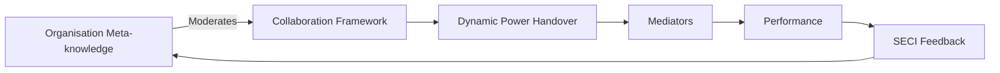

# HMCForge

**Design, run and evaluate Human-Machine Collaboration frameworks — without fighting your infra.**

HMCForge is a Python scaffold for teams that build, measure and iteratively improve
*who does what* between AI systems and human experts. It turns the abstract idea of
"human-machine collaboration" into something you can prototype in an afternoon, run
through a simulation, grade on real metrics, and evolve — all while staying true to
one simple mechanism: **dynamic power handover**.



```
Read the docs
  docs/index.md       the model behind the platform
  docs/tutorial.md    build your first framework in 10 minutes
  docs/scenarios.md   three ready-to-run case studies
  docs/api.md         API reference
```

---

## Why another framework?

Most "AI orchestration" tools ask you to wire an LLM into a pipeline. That is not
the hard part. The hard part is *deciding who is in control at every step*, knowing
whether that decision was a good one, and turning the evidence into a better policy
next week.

HMCForge answers three questions explicitly:

1. **Who controls each step?** You define the handover logic (policies or a custom
   subclass). We run the choreography.
2. **Did it work?** We measure the process variables that actually mediate outcomes —
   human fatigue, cognitive load, decision time, handover accuracy — and the outcomes
   themselves: quality, efficiency, safety.
3. **What do we know now?** A built-in SECI feedback loop converts observed
   performance into updated organisational meta-knowledge that moderates the next
   round of collaboration.

It is not a workflow engine, not a chatbot SDK, and not a lock-in. It is a measuring
tape and a workshop for your collaboration design.

## What's inside

| Layer | Pieces | You control |
|---|---|---|
| **Meta-knowledge** | `OrganizationalMetaknowledge`, risk-responsibility bands | The moderator: AI boundary, expert capability, handover timing |
| **Framework** | `HMCFramework` base + `HandoverDecision` | Your dynamic power handover logic |
| **Policies** | Risk gate, confidence, load-aware, composite, always-AI/expert | Reusable handover rules, moderated by meta-knowledge |
| **Actors** | `RuleBasedAI`, `SimulatedExpert`, `OpenAIAdapter` | Drop in a real LLM or a live human client |
| **Mediators** | Fatigue, cognitive load, decision time, handover accuracy | Add your own process variables |
| **Performance** | Quality, efficiency, safety | Add your own DVs |
| **Feedback** | `SECIEngine` (socialise / externalise / combine / internalise) | Tune the learning rate, add your own rules |
| **Observability** | Trace recorder, JSON + Markdown reports | Export to your own pipelines |

## Quick start

```bash
pip install aicrusaders
```

Run a full scenario end-to-end:

```python
from hmcforge import SimulationRunner, SECIEngine
from hmcforge.scenarios import healthcare_triage

report = SimulationRunner(healthcare_triage.framework(), seed=3).evaluate_tasks(
    healthcare_triage.tasks()
)
print(report.to_markdown())

update = SECIEngine(healthcare_triage.default_metaknowledge()).run(report)
updated = update.apply(healthcare_triage.default_metaknowledge())
print("new AI boundary:", updated.ai_boundary)
```

Or grab a ready-made demo with the CLI:

```bash
hmcforge-demo
```

## Design your own framework in 4 moves

### 1. Describe the work

```python
from hmcforge import StepSpec, TaskSpec

task = (
    TaskSpec("loan-1", "Auto loan underwriting")
    .add_step(StepSpec("extract", "Extract applicant data", complexity=0.3, risk=0.2))
    .add_step(StepSpec("approve", "Decision memo", complexity=0.7, risk=0.8))
)
```

### 2. Pick a framework — compose or subclass

The fastest path: compose built-in policies into a plain `HMCFramework`:

```python
from hmcforge import HMCFramework
from hmcforge.policies import CompositePolicy, ConfidencePolicy, RiskGatePolicy

framework = HMCFramework(
    name="my-review-framework",
    policies=[
        CompositePolicy([
            RiskGatePolicy(base_threshold=0.5),
            ConfidencePolicy(floor=0.4),
        ])
    ],
)
```

The most expressive path: subclass and write the handover rule yourself.

```python
from hmcforge import HMCFramework, HandoverDecision, Role

class MyFramework(HMCFramework):
    def decide_handover(self, step, session):
        # your own logic: risk, fatigue, confidence, anything
        if step.step.risk > 0.6 and session.current_controller is Role.AI:
            return HandoverDecision(Role.EXPERT, reason="high risk")
        return HandoverDecision(session.current_controller)
```

### 3. Grade it

```python
report = SimulationRunner(framework, seed=7).evaluate_repeated(task, n_runs=20)
report.to_json("loan-report.json")
print(report.to_markdown())
```

### 4. Learn from it

```python
update = SECIEngine(metaknowledge, learning_rate=0.2).run(report)
framework.metaknowledge = update.apply(framework.metaknowledge)  # next round is moderated
```

## Built-in scenarios

Three opinionated, runnable case studies — start from any of them.

| Scenario | Handover philosophy | Highlights |
|---|---|---|
| `healthcare_triage` | Human-in-the-loop safety net | Risk-gated escalation, expert owns red flags |
| `financial_underwriting` | Confidence-driven delegation | Composite policy, expert owns judgement calls |
| `code_review` | Efficiency-driven, load-aware | AI-first, engineers join for critical files |

```bash
python -c "from hmcforge.scenarios import code_review; print(code_review.framework().name)"
```

## Plug in a real LLM (or a real human)

Both sides of the handover are protocols. Swap the rule-based actors for anything:

```python
from hmcforge import OpenAIAdapter

ai = OpenAIAdapter()  # reads USER_LLM_API_KEY / USER_LLM_BASE_URL / USER_LLM_MODEL
report = SimulationRunner(framework).evaluate_tasks(tasks, ai=ai)
```

Or implement `AIModel` / `Expert` yourself — a single method, `act(step, session)`,
so wiring in your internal model or a live operator UI takes minutes.

## Why the metrics look the way they do

Every framework run produces an `EvaluationReport` with two metric families:

- **Mediators (process)** — *fatigue*, *cognitive load*, *decision time*,
  *handover accuracy*. These are the variables your handover design actually moves.
- **Performance (outcomes)** — *quality* (pass rate), *efficiency*
  (time vs ideal, including handover overhead), *safety* (risk-weighted
  accountability). These are what your organisation ultimately cares about.

The SECI engine reads both, distils lessons, and patches the meta-knowledge
(AI boundary, expert session limits, handover cost budget) so the next run of your
framework is moderated by what actually happened. See `docs/theory.md` for the
details and the notation.

## Development

```bash
git clone https://github.com/hmcforge/hmcforge.git
cd hmcforge
pip install -e ".[dev]"
pytest
```

Everything is deterministic given a seed, so your experiments are reproducible.

## Roadmap

- [ ] Live human-in-the-loop driver (wait-for-operator expert adapter)
- [ ] Chart exports for mediator time-series
- [ ] A/B comparison runner for framework variants
- [ ] Statistical significance helpers for repeated runs

## License

Apache-2.0. Go build something that works better for the humans on the loop.
