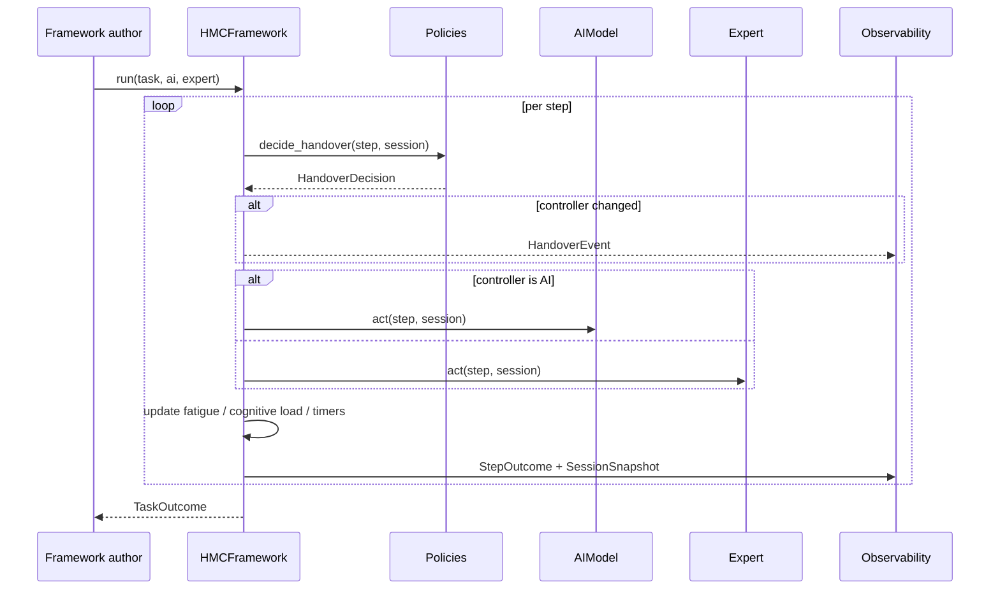

# Architecture

HMCForge is a small core with open seams. Everything a framework author touches is
a protocol or a thin base class; the platform supplies choreography, measurement
and reporting.

## Package layout

```
src/hmcforge/
  core/types.py        Task, Step, roles, handover events, outcomes, snapshots
  framework.py         HMCFramework base + HandoverDecision
  policies.py          HandoverPolicy + built-in policies + SessionState
  metaknowledge.py     OrganizationalMetaknowledge, RiskResponsibility
  mediators/           process-variable measurement
  performance/         outcome measurement
  runner.py            SimulationRunner, EvaluateReport aggregation
  observability.py     TraceRecorder, EvaluationReport, exporters
  seci.py              SECIEngine, KnowledgeUpdate, Lesson
  adapters.py          AIModel / Expert protocols + rule-based + LLM adapters
  scenarios/           three runnable case studies
```

## Data flow of a run



## Key design decisions

### 1. The framework is a single method

`HMCFramework` exists to answer one question per step: *who controls this step?*
Everything else — running actors, recording events, accumulating session state — is
shared choreography. You either compose built-in policies or override
`decide_handover`; you never fight the loop.

### 2. Session state is explicit

`SessionState` is the runtime ledger (fatigue, cognitive load, active seconds,
overhead, step counts). Policies and actors both read it, which is what makes
load-aware handover possible without global variables.

### 3. Time is simulated

A task's `elapsed` is the sum of decision latencies plus handover overhead, not
wall-clock time. This keeps simulations deterministic and lets the efficiency
metric react to your handover design rather than to CPU speed. Inject a custom
`clock` for fully deterministic event timestamps.

### 4. Everything measurable is a result object

Mediators and performance metrics both produce `MetricResult` (value, label,
whether higher is better, per-step series, detail). Reports, JSON exports and the
SECI engine all consume the same shape, so adding your own metric is a matter of
one class.

### 5. Actors are protocols

`AIModel` and `Expert` each need one method: `act(step, session) -> AgentDecision`.
Swap in an LLM adapter, a rule-based bot, or a client that renders the step to a
human operator.

## Extending

- **New handover logic** — subclass `HMCFramework` or compose `HandoverPolicy`s.
- **New mediator** — subclass `MediatorBase` (`compute(outcome) -> MetricResult`).
- **New performance metric** — subclass `PerformanceMetric`.
- **New feedback rule** — subclass `SECIEngine` and override the stages, or add
  your own combine rules.
- **Real actors** — implement `AIModel` / `Expert`, or use `OpenAIAdapter`.

See the [tutorial](tutorial.md) for worked examples of each.
