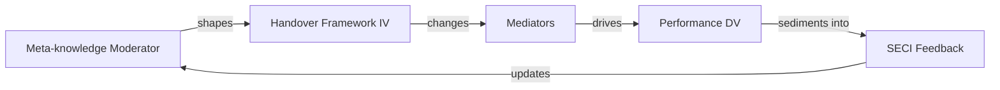
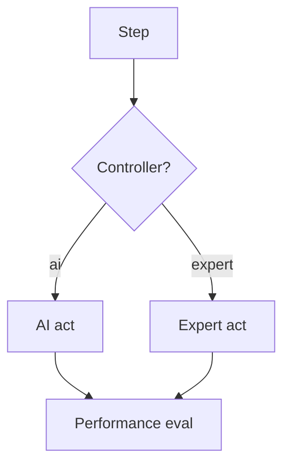

# The model behind the platform

HMCForge operationalises a specific, evidence-shaped view of how human-machine
collaboration affects organisational performance. That model is the reason the
API looks the way it does. Understand it once, and the library becomes obvious.

## The causal chain

| Position | In HMCForge | Meaning |
|---|---|---|
| Moderator | `OrganizationalMetaknowledge` | The organisation's understanding of AI boundaries, expert capability, risk responsibility and handover timing. Shapes how the framework is tuned. |
| Independent variable | `HMCFramework` | The collaboration framework, concretely realised as *AI-Expert dynamic power handover*. |
| Mediators | `FatigueMediator`, `CognitiveLoadMediator`, `DecisionTimeMediator`, `HandoverAccuracyMediator` | Process variables that handover changes *before* outcomes move. |
| Dependent variable | `QualityMetric`, `EfficiencyMetric`, `SafetyMetric` | What the organisation ultimately cares about. |
| Feedback | `SECIEngine` | Performance, through Nonaka's SECI process, sediments into new meta-knowledge for the next round. |

## Why the mediators are there

The central claim is that dynamic handover does **not** affect performance
directly. It changes intermediate process variables first:

- **Fatigue / cognitive load** — every handover to a human consumes attention.
  Load-aware handover protects the human and keeps later decisions sharp.
- **Decision time** — handing control back and forth is not free. Each handover
  carries overhead, and expert time is more expensive than AI time.
- **Handover accuracy** — a handover is "correct" when it moves control to the role
  the organisation has decided should own that step's risk band. Zig-zagging
  (AI -> expert -> AI) is churn, not collaboration.

Measuring these three makes the mechanism visible: two frameworks can achieve the
same quality while one destroys the human's attention budget.

## How meta-knowledge moderates

Policies read meta-knowledge to set their thresholds. For example:

- `RiskGatePolicy` gates at `base_threshold * ai_boundary.max_complexity` — a
  conservative organisation (narrow AI boundary) hands risk to the expert sooner.
- `LoadAwarePolicy` uses `expert_capability.max_steps_per_session` as the reference
  point for the human's session budget.
- `HandoverAccuracyMediator` and `SafetyMetric` grade runs against the
  `risk_responsibility` bands.

So the same code, bound to different meta-knowledge, behaves like a different
collaboration culture. That is the moderation effect, made executable.

## The SECI feedback loop

SECI is Nonaka's model of organisational knowledge creation. HMCForge maps it to
pipeline stages:

| Stage | What the engine does |
|---|---|
| Socialisation | Distils shared field observations across runs ("the team averaged N handovers"). |
| Externalisation | Converts observations into explicit lessons ("when fatigue exceeds 0.6, offload to the AI"). |
| Combination | Merges lessons into numeric meta-knowledge patches (narrow the AI boundary, grow the expert session limit, adjust the handover cost budget). |
| Internalisation | Emits recommended policy knobs for the next round (ceiling thresholds, gate values). |

`KnowledgeUpdate.apply()` produces a fresh, versioned copy of the meta-knowledge,
so you can always diff what the organisation *believes* after a round of
collaboration.

## The notation in one diagram

For the full API surface, see the [API reference](api.md).
